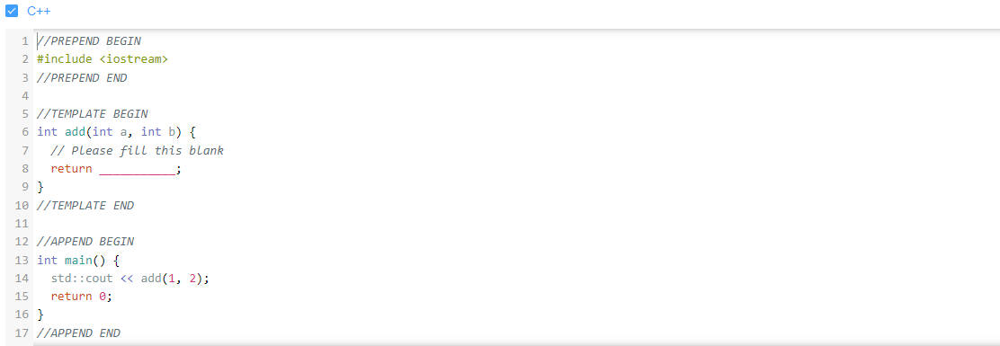

# 录入题目

## 编程题录入流程

`以SuperAdmin账号为例`

1. 以有题目权限的账号登录前台

2. 选定侧边导航问题-编程题列表

3. 进入编程题列表页，点击create按钮

4. 按照表单进行填写

相关填写字段如下：
    1. 显示ID-必填，不可重复，格式应为SKXXXX，其中XXXX为四位数字，如SK1001
    2. 题目标题-必填，可重复
    3. 题目描述-必填，可重复
    4. 输入描述-必填，可重复
    5. 输出描述-必填，可重复
    6. 时间限制-默认为1000ms
    7. 内存限制-默认为256M
    8. 难度-必选，可重复
    9. 是否可见-默认为可见
    10. 是否可以分享提交-即提交记录是否公开，默认为不公开
    11. 标签-必填，可添加多个
    12. 编程语言-多选，默认全选
    13. 样例输入输出-至少一组，可添加多组
    14. 提示-可不填
    15. 代码模板-多选，默认全不选
    16. 是否使用Special Judge-可选，仅支持C/C++
    17. 题目类型-必选，可选项为：ACM/OI
    18. 测试用例-必需上传，zip格式
    19. IO类型-必选，可选项为：标准IO/文件IO
    20. 题目来源-可不填、

### 特殊字段详细描述

#### 富文本字段

描述、输入描述、输出描述、提示均为富文本字段
支持插入图片、代码、公式等，支持LaTeX公式语法，支持Markdown语法
可修改字号、颜色等

#### 标签

点击新增标签会出现一个input框，输入标签名后回车即可添加标签
想要取消新增，清空input框后回车即可
想要删除标签，点击标签后面的x即可

#### 编程语言

编译器版本号通过鼠标悬停在编程语言上即可查看

#### 样例输入输出

可以通过点击添加样例按钮添加多组样例输入输出
可以通过点击样例上的Delete按钮删除样例
可以通过点击样例下的收起行按钮收起样例

#### 代码模板

选中相应语言即可编辑代码模板
以C++为例，点击C++后会出现一个编辑器，可以在编辑器中编辑代码模板

`PREPEND`部分以及`APPEND`部分为代码模板的前后缀，不会被用户提交的代码覆盖，且不会展示给用户


#### Special Judge

Special Judge是一种特殊的评测方式，可以用来评测一些特殊的题目，如输出格式不固定的题目

需要去编写SPJ代码，用来判断用户提交的代码是否正确
一般使用Special Judge都是因为题目的答案不唯一，更具体一点说的话一般是两种情况：

题目最终要求输出一个解决方案，而且这个解决方案可能不唯一。

题目最终要求输出一个浮点数，而且会告诉只要答案和标准答案相差不超过某个较小的数就可以，比如0.01。这种情况保留3位小数、4位小数等等都是可以的，而且多保留几位小数也没什么坏处。

##### Special Judge判题程序示例

```cpp
#include <stdio.h>

#define AC 0
#define WA 1
#define ERROR -1

int spj(FILE *input, FILE *user_output);

void close_file(FILE *f){
    if(f != NULL){
        fclose(f);
    }
}

int main(int argc, char *args[]){
    FILE *input = NULL, *user_output = NULL;
    int result;
    if(argc != 3){
        printf("Usage: spj x.in x.out\n");
        return ERROR;
    }
    input = fopen(args[1], "r");
    user_output = fopen(args[2], "r");
    if(input == NULL || user_output == NULL){
        printf("Failed to open output file\n");
        close_file(input);
        close_file(user_output);
        return ERROR;
    }

    result = spj(input, user_output);
    printf("result: %d\n", result);
    
    close_file(input);
    close_file(user_output);
    return result;
}

int spj(FILE *input, FILE *user_output){
    /*
      parameter: 
        - input，标程输入的文件指针
        - user_output，用户输出文件的指针
      return: 
        - 如果用户答案正确，返回AC
        - 如果用户答案错误返回WA
        - 如果主动捕获到自己的错误，如内存分配失败，返回ERROR
      请用户完成此函数.
      demo:
      int a, b;
      while(fscanf(f, "%d %d", &a, &b) != EOF){
          if(a -b != 3){
              return WA;
          }
      }
      return AC;
     */
}
```

#### 测试用例

对于普通题目，测试用例文件包括in和out两种拓展名，对于Special Judge就只有in一种文件。

每个测试用例的文件名须由数字开头，例如有两组测试用例，则对于普通题目测试用例的文件名分别为1.in, 1.out, 2.in, 2.out，SPJ的文件名分别为1.in, 2.in。其他形式的文件后台均不识别。

压缩时，请将文件都放在压缩包的根目录，而不是包含在某一个文件夹中，比如正确的格式是


## 客观题录入流程

客观题录入流程与普通题录入流程类似，只是在录入题目时，需要按照客观题的字段进行录入。


### 客观题字段

1. 显示ID-必填
2. 题目-必填
3. 题干-必填-富文本
4. 是否可见-默认可见
5. 标签-必填，可新增多个标签
6. 难度-必选，可选项为：低/中/高
7. 客观题类型-必选，可选项为：单选题/多选题/判断题
8. 来源-可不填
9. 选项-必填，且不重复，单选多选情况下可新增多个选项
10. 提示-默认为无

### 客观题特殊字段详细描述

#### 富文本字段-客观题

题干、提示、选项均为富文本字段

#### 标签-客观题

同编程题

#### 选项

选项分为两种情况：
对于单选、多选，默认四个选项，且将第一个选项视为正确选项，可新增选项，可删除选项，可调整选项正误
对于判断题，只有两个选项，且将第一个选项视为正确选项，不可新增选项，不可删除选项，可调整选项正误
